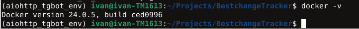

# Телеграм-бот для BestChange.
_С помощью этого телеграмм-бота можно узнать текущие цены криптовалют в определённых обменных пунктах и топ 10 обменных пунктов на BestChange._
## Инструкция по запуску телеграм-бота: ##
1. Зарегистрировать бота с помощью телеграм-бота @BotFather
2. Склонировать репозиторий
```
git clone https://github.com/NoRIS95/BestchangeTracker.git
```
3. Скопировать файл .env для токена тг-бота
```
cp .env.template .env
BOT_TOKEN=<вписать сюда токен тг-бота из п.1> # в .env файле
```
4. Создать виртуальное окружение и активировать
```
python3 -m venv env
source ./env/bin/activate
```
5. Установить Python зависимости
  ```
  pip install -r requirements.txt
  ```

### Создание контейнера для запуска телеграмм-бота ###
1. Проверка, установлен ли Docker на сервере
```
docker -v
```
Если докер установлен, то отобразится примерно такое сообщение


В таком случае можно переходить сразу к п.3, если такое сообщение не отобразилось, значит переходим к п.2

2. Установка Docker

```
sudo apt install Docker
```
3. Сборка Docker образа
```
sudo docker build -t bestchange-bot .
```
 
### Запуск телеграм-бота ###
 
```
sudo docker run --env-file .env --name bestchange-bot-container bestchange-bot
```
